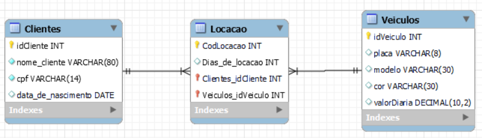

<h1 align="center"> Locação de Automóveis (NORMALIZAÇÃO)</h1>

<h5>Tabela</h5>


<h2>Objetivos:</h2>
Observar a tabela não normalizada de uma locadora de veículos e aplique a 3ª Forma normal

<ol> 
  <li>Fazer o modelo lógico de banco de dados relacional</li>
  <li>Escrever o script que cria as tabelas</li>
  <li>Criar uma view que seleciona todas as locações e seus respectivos veículos e clientes</li>
</ol>

<h3>1- Modelo lógico</h3>



<h3>2- Escrever o script que cria as tabelas</h3>

```mysql
SET @OLD_UNIQUE_CHECKS=@@UNIQUE_CHECKS, UNIQUE_CHECKS=0;
SET @OLD_FOREIGN_KEY_CHECKS=@@FOREIGN_KEY_CHECKS, FOREIGN_KEY_CHECKS=0;
SET @OLD_SQL_MODE=@@SQL_MODE, SQL_MODE='ONLY_FULL_GROUP_BY,STRICT_TRANS_TABLES,NO_ZERO_IN_DATE,NO_ZERO_DATE,ERROR_FOR_DIVISION_BY_ZERO,NO_ENGINE_SUBSTITUTION';


CREATE SCHEMA IF NOT EXISTS `locacao_automoveis` DEFAULT CHARACTER SET utf8 ;
USE `locacao_automoveis` ;

CREATE TABLE IF NOT EXISTS `locacao_automoveis`.`Clientes` (
  `idCliente` INT NOT NULL,
  `nome_cliente` VARCHAR(80) NOT NULL,
  `cpf` VARCHAR(14) NOT NULL,
  `data_de_nascimento` DATE NULL,
  PRIMARY KEY (`idCliente`))
ENGINE = InnoDB;

CREATE TABLE IF NOT EXISTS `locacao_automoveis`.`Veiculos` (
  `idVeiculo` INT NOT NULL,
  `placa` VARCHAR(8) NULL,
  `modelo` VARCHAR(30) NULL,
  `cor` VARCHAR(30) NULL,
  `valorDiaria` DECIMAL(10,2) NULL,
  PRIMARY KEY (`idVeiculo`))
ENGINE = InnoDB;

CREATE TABLE IF NOT EXISTS `locacao_automoveis`.`Locacao` (
  `CodLocacao` INT NOT NULL,
  `Dias_de_locacao` INT NULL,
  `Clientes_idCliente` INT NOT NULL,
  `Veiculos_idVeiculo` INT NOT NULL,
  PRIMARY KEY (`CodLocacao`, `Clientes_idCliente`, `Veiculos_idVeiculo`),
  INDEX `fk_Locacao_Clientes_idx` (`Clientes_idCliente` ASC) VISIBLE,
  INDEX `fk_Locacao_Veiculos1_idx` (`Veiculos_idVeiculo` ASC) VISIBLE,
  CONSTRAINT `fk_Locacao_Clientes`
    FOREIGN KEY (`Clientes_idCliente`)
    REFERENCES `locacao_automoveis`.`Clientes` (`idCliente`)
    ON DELETE NO ACTION
    ON UPDATE NO ACTION,
  CONSTRAINT `fk_Locacao_Veiculos1`
    FOREIGN KEY (`Veiculos_idVeiculo`)
    REFERENCES `locacao_automoveis`.`Veiculos` (`idVeiculo`)
    ON DELETE NO ACTION
    ON UPDATE NO ACTION)
ENGINE = InnoDB;


SET SQL_MODE=@OLD_SQL_MODE;
SET FOREIGN_KEY_CHECKS=@OLD_FOREIGN_KEY_CHECKS;
SET UNIQUE_CHECKS=@OLD_UNIQUE_CHECKS;

```
